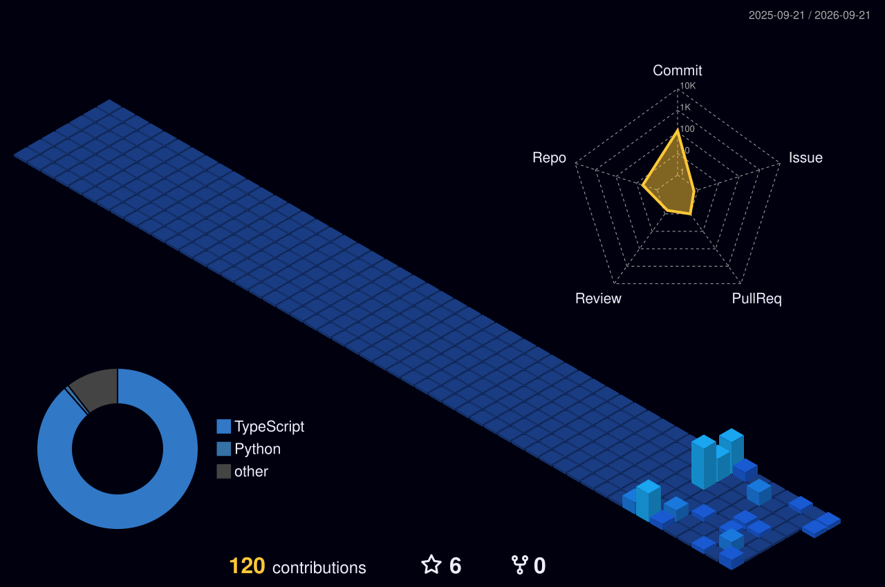

<div align="center">


<br/>

<a href="https://github.com/itzstebin">

</a>
&nbsp;
<a href="https://github.com/itzstebin?tab=followers">

</a>
&nbsp;
<a href="https://github.com/itzstebin?tab=repositories">

</a>

<br/><br/>

<a href="https://cybroatrix.com">

</a>

</div>

---

## 👨‍💻 About Me

I'm **Stebin**, a **CSE / Computer Science student** interested in software development, cybersecurity, networking and emerging technology.

I learn mainly by **building projects and experimenting with things I don't fully understand yet**.

Currently exploring:

* 💻 Web development & modern frontend
* 🐍 Python & programming fundamentals
* ⚙️ C programming
* 🟨 JavaScript & TypeScript
* 🛡️ Cybersecurity & networking
* 🧩 CTFs, OSINT & digital forensics
* 🤖 AI / ML & local language models
* 📺 IPTV, streaming & media applications

```text
Learn → Build → Break → Debug → Understand → Improve
```

---

## 🚀 Current Projects

### 🛡️ Cybroatrix

My technology and cybersecurity-focused project.

I'm using it to explore **cybersecurity, networking, web development and technical education**, while creating projects and content around those areas.

**Focus:** `Cybersecurity` `Networking` `Web` `Education`

🌐 **https://cybroatrix.com**

---

### 🎬 BingeHub

A streaming / movie platform experiment.

I've worked with:

`React` `TypeScript` `Vite` `M3U/IPTV` `HLS` `APIs`

The project explores movie interfaces, search, streaming playlists and browser-based media playback.

---

### 🤖 AI & Local Model Experiments

I've experimented with building and running AI systems locally, including:

* Python chatbot projects
* Local language models
* PyTorch
* Character-level models
* Model training
* Memory-based chatbot concepts

I'm interested in understanding **how AI systems work**, not only using them.

---

## 🧰 Technologies

<div align="center">


</div>

### 🔍 Areas I'm Exploring

`Cybersecurity` · `Networking` · `Web Security` · `CTFs` · `OSINT` · `Digital Forensics` · `Steganography` · `Reverse Engineering` · `AI/ML`

---

## 📂 Other Projects

| Project                 | Description                                                   |
| ----------------------- | ------------------------------------------------------------- |
| 🎮 **Guess the Number** | One of my early Python programming projects                   |
| 🌐 **Web Projects**     | Websites and experiments built while learning web development |
| 📺 **IPTV Experiments** | M3U playlists, HLS playback and streaming interfaces          |
| 🤖 **AI Experiments**   | Local models, chatbot and model-training experiments          |

---

## 📚 Currently Learning

```text
C Programming
     ↓
Programming Fundamentals
     ↓
Web Development
     ↓
Networking
     ↓
Cybersecurity
     ↓
AI / Machine Learning
```

My goal is to build **strong fundamentals first**, then use them to create bigger systems.

---

## 📊 GitHub

<div align="center">


<br/><br/>


</div>

---

## 📈 Contribution Activity

<div align="center">


</div>

---

## 🧊 3D Contributions

<div align="center">



</div>

---

## 🐍 Contribution Snake

<div align="center">


</div>

---

## 🏆 GitHub Trophies

<div align="center">


</div>

---

## ♟️ Beyond Code

When I'm away from the keyboard:

**♟️ Chess** · **🎮 Minecraft** · **🎨 Editing & Design** · **🎬 Creative Projects** · **🧠 Technology**

---

## 📫 Connect

<div align="center">

<a href="https://github.com/itzstebin">

</a>

<a href="https://cybroatrix.com">

</a>

</div>

<br/>

<div align="center">

### 💻 Build it. Break it. Understand it.

**Still learning. Still building. 🚀**

</div>


